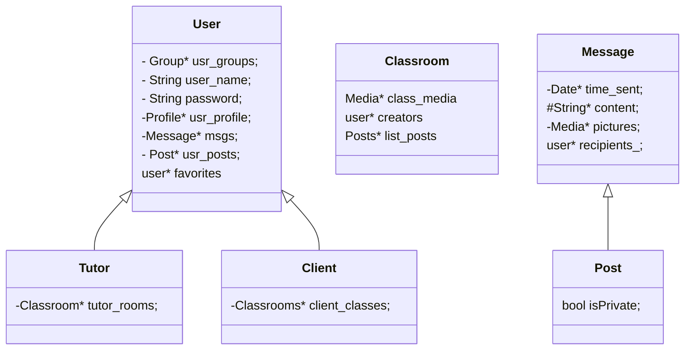

```mermaid
%% (coming soon!)
%% Body of FlowChart 1 for idea #8
%% For reference, Idea #8 is as follows: Create a Website-based database for job applicants for different organizations

flowchart TB
  %% (cont here by ideating process of entity navigating through the system OR the system navigating through itself)
%% Body of nodes and edges that describe interface 
description["description"] --> descIntf0["User is forced to choose whether they're an applicant or administrator, when creating their account and when attempting to login. "] --> descIntf0.1["If user chooses administrator, User is asked &forall;y &in; {Organization, Admin Username, Admin password, (cont here if applicable)} through the form of a credential screen"] --> descIntf0.2["User is met with a screen that allows them to do x where x &in; {surf through all job-applicants,change organization[which would cater to people who run multiple businesses], logout, (cont here if applicable)"] --> descIntf0.3["User is able to go into more detail about job-applicants"] --> descIntf0.4["User is able to accept or reject job-applicants"] --> descIntf0.5["User is able to set stages of job-applicant process"] -->  descIntf0.6["User is able to send direct feedback to the job-applicant"] -->   descIntf0.7["User is able to communicate with other adminstrators. And if user is a job-applicant, they're also able to communicate with other job-applicants"] --> descIntf0.8["User is able to receive notification x where x &sube; {messages, interviews, rejections, round upgrades, (cont here if applicable)}"]

%% --> descIntf0.9["(cont here if applicable, thought(s) before stopping: 1) Implementing heavy cybersecurity for program, 2) At this point, it seems like everything required for this to work is present. Thus, currently want to add things that convenience users. 3) At this point, seems like everything to support the user is acheived using the aforementioned process"]

%% (cont here, after implementing other subgraphs in code)
%% end of nodes and edges that desc interface


    %% Code below addresses particular cases in regards to user interactions: 
    %% NOTE: Consider having below nodes and edges be a subgraph named theoretical user interactions
    deci0["User decides to login to check the statuses of their applications"] --> deci0.1["User logs in as an applicant"] --> deci0.2["User navigates to a toolbar to see the statuses of their applications"]
    deci1["User decides to login to check the number of applicants to a particular job"] --> deci1.1["User logs in as an administrator"] --> deci1.2["User goes to job section"] --> deci1.3["User selects the job that they posted"] --> deci1.4["User observes the number of applicants for that job with the option to look at all applicants that applied"]
     deci2["User decides to create an account "] --> deci2.1["User clicks button on initial state page and is redirected to page to create an account"]
    %%(cont here IF Applicable) -->
     deci3["User decides to logout "] --> deci3.1["User accesses toolbar to logout[means, need to have toolbar as one of static state(s)]"]
    %%(cont here) -->
     deci4["User decides to create an admin account with an intention to join an existing organization to help manage applicants"] --> deci4.1["User navigates to initial state and then creates an account and then joins the existing organization referenced by a dropdown menu"] --> deci4.2["User is unable to acess admin options involving their organization until they are accepted by the organization's creator"]
     %%(cont here IF Applicable) -->
    deci5["User decides to send dm to anoother job applicant"] --> deci5.1["User navigates to message state"] --> deci5.2["User clicks feature to dm the job applicant of their choice"] --> deci5.3["User writes and sends message"]
    %% NOTE: This is a feature that can be shortcut for experienced users via the job applicant's page. Can be something to add in a future update for app. 
   %%  (cont here) --> 
    deci7["User decides to delete account"] --> deci7.1["User accesses setting page"] --> deci7.1["User clicks feature that permits deletion of account and accepts terms via prompt"] 
    %% (cont here) -->
    %% Also, brainstorm some paritcular use cases for this application. 





    %%  end of Code that addresses particular cases in regards to user interactions: 


    %% Feature(s) succeeding this point are optional
    %% PN: The stuff above will be the template that I use to map out func of future projects!

    %% body of how system will react to implicit and explicit requests by user via http. 
    subgraph systemReactions
      direction TB
          subgraph rel-Sets-rep
          direction TB
          %% (cont here by modifying inptu below by making it general to prep it for specialization w.r.t the idea at hand). UPDATE #1: 100% complete
          respIntf0["System receives data x that determines y, resulting in (x,y) where x &in; set of 2-tuples containing username and password and sends a bool value if (x,y) &in; &rho; where &rho; = x &in; U(users) in database."] --> respIntf0.1["System sends data z that determines a, resulting in (z,a) where z &in; U(users) and a &in; {U(job applications), current organization, profile, direct messages, (cont here if applicable) <insert elements relevant to assigning membership to user>} and sends a bool value if (z,a) &in; &rho; where &rho; = z is a y."] 
          respIntf0.1 --> respIntf0.1.0["System receives data from user x requesting access to w, resulting in data retreival from database referencing data associated with w where w &in; {Other users, Organizations, notifications(x), preferences(x) <insert elements relevant to data that is requested by user(s)}"] --> respInf0.1.1["If (x,w) &nin; &cup;<sub>1 &le; i &le; n</sub> &rho;<sub>i</sub>, then user isn't valid. The n relations are as follows: { x wants to see organization(s) w that are hiring on job board, x wants to see message(s) w received, x wants to see message(s) w sent, <insert the relations between data and user requests that permit the request and retrieval of the data>}"]
          respIntf0.1 --> respIntf0.2["System receives data from user x requesting modification to u, resulting in data update from database referencing data associated with u where u &in; { Profile(x) ,AboutSection(x), StatusesOfMessages(x), FavoritedJobs(x), FavoritedOrganizations(x),  JobApplications(x), admins(organization(x)), preferences(x) (cont here IF applicable) <insert elements that are properties(x) associated with user x>}"]
          respIntf0.1 --> respIntf0.3["System receives data from user x requesting DELETION to u, resulting in data DELETION from database referencing data associated with u where u &in; {accountDeletion(x), messages(x), FavoritedJobs(x), FavoritedOrganizations(x), JobApplications(x), admins(organization(x)), notification(x), (cont here) <insert elements that are properties(x) associated with user x>}"]
          respIntf0.1 --> respIntf0.4["System receives data from user x requesting CREATION to u, resulting in data CREATION and adding it to database referencing data associated with u where u &in; { accountCreation(x), messages(x),FavoritedJobs(x), FavoritedOrganizations(x), JobApplications(x), admins(organization(x)), notification(x), preferences(x)  <insert elements that are properties(x) associated with user x>}"]

          end
          subgraph regularVersion
          direction TB
            respIntf0["in prog"]

          end
      %% (cont here with non-rel-sets-rep)
      %% (cont here at descIntf0.2.1[by addressing all cases where data may be modified]) 
      %%, need to go back to UX desc and think about how relations can be used to describe modifying data, creating data, and deleting data[basically using relations to allow CRUD operations])[NOTE: In future, when writing powerpoint, goal is to transform these relations into nodes and edges to ensure that anyone can understand this process][Note as of 6/13/25: This was complete, this will be the approach taken for the rest of the backend procedures going forward. Will also have relation-sets verison as a subgraph and have the expanded, non-relation-sets version as a subgraph. 

      end

    %%end of body of how system will react to implicit and explicit requests by user via http



%% end of body of Flowchart 1

```

```mermaid
%% (coming soon!)
%% Body of ClassDiagram 1 for idea #8
%% For reference, Idea #8 is as follows: Create a Website-based database for job applicants for different organizations
classDiagram
  %% body of class imps
  class user {
     -message* usr_msgs;
     -profile* usr_profile; 
     %%^^ if user is admin, they should have ability to manage multiple job applicant(s)'s profiles or see rather. The first profile will always reference the user's profile tho. 
  -Application* apps;
  %%^^^ will be sorted in pending, non-pending status applications, and submitted applications. & received applications for job_apps and admins RESPECTIVELY. 
  -Job* assoc_jobs; 
  %%^^^ will be sorted as available jobs, and favorited jobs. For Admins, it will be published jobs and unpublished jobs. 
  -string username;
  -string password;
  Organization* favorites
  %% ^^ will reference favorite Organizations. May not have favorites for the Adminstrators themselves tho. 
  %%[ALSO, need ot include getters and setters]

 %% (cont here by inserting the member vars and funcs that'll be required for this class[don't forget the getters and setters])
  }
  class Application {
     -int status
     %% ^^ will reference THREE vals: accepted, rejected, pending . 
     %% (cont here by inserting the member vars and funcs that'll be required for this class[don't forget the getters and setters])
  }
  class Organization {
    -String name;
    -user* members;
    -Job* jobs_provided;




  %% class is needed to house job-applications for people to apply to. May also need some condition that allows organization to filter job-applications to be posted or not. 

  }
  class Job {
    -String name;
    -String requirements;
    -String preferredQuals;

  %% (cont here with members that help a job post be clear as possible)




  }
  class message {
     %% bool isGroup
     %% int groupNum; 
      -Date* time_sent;
      #String* content;
      -Media* picture;
     %% ^^ will be used to keep track of placement of messages
     %% NOTE: Need to consider how order of messages in a group chat or non-group chat will be 
     %% kept consistent. First thing I thought about is utilizing the date object.  Due to complexity, goal is to ignore the inclusion of group chats for now. 

 %% (cont here by inserting the member vars and funcs that'll be required for this class)

  }
  class Media {
  <<enumeration>>
  PICTURE
  VIDEO

 %% (cont here by inserting the enum constants that will be required for this class)
  }
  class profile {
  %% List of things I thought of: 1) Name, 2) Education, 3) Expertise, 4) About, 5) (cont here IF applicable)
     string name;
     string education; 
     string expertise;
     string about;
     %% ^^ can have this be an object or merely a string that takes in values delimited using : tabs, etc. [UPDATE: Ditched this b/c it would be too abstract when presenting information].
     %% (cont here by inserting the member vars and funcs that'll be required for this class)[for this clas, focus is on identifying the main attrs of a profile]
  }
  %% the job applicants and admins will inherit from the user object
  class job_applicants {
 %% (cont here by inserting the member vars and funcs that'll be required for this class)[will need funcs for CRUDing data referenced by container member vars. NOTE: THis is really for UML purposes since this will be carried out using HTTP requests to the database and things like that. ]
  }
  class admin {
 %% (cont here by inserting the member vars and funcs that'll be required for this class)[will need funcs for CRUDing data referenced by container member vars. NOTE: THis is really for UML purposes since this will be carried out using HTTP requests to the database and things like that. ]
  }


  %% end of class imps

  %% body of relationships between classes
  admin --|> user 
  %% NOTE: Will also need to put the functional relationships as well, aka 0:M, M:M, etc. 
  job_applicants --|> user
  message --* user
  profile --* user
  %%(cont here by writing the necessary relationships)[will need funcs for CRUDing data referenced by container member vars. NOTE: THis is really for UML purposes since this will be carried out using HTTP requests to the database and things like that. ]


  %% end of body of relationships between classes


  %%(cont here by referring to UX description in flowchart directory)
%% NOTE: At this point, I believe more members will come about when their respective schemas are implemented. 

%% end of ClassDiagram 1 for idea #8

```

[Purpose]: <> "The purpose of this document is to house the formatting scheme for my readme file for my git remote repo associated with my resume."

# Project List
IP = In Progress

## Computer Science

### Personal Projects
#### Process Automation
##### [SetupScript: Windows Powershell](https://github.com/ArdoineDocteur/RepoAssociatedWResume/blob/main/vs-codeWtihC%2B%2BCompilersScript.ps1)

Purpose: Created a powershell script to automate the installation of Visual Studio Code and the C/C++ Compilers. 
#### Application Development
##### [YatzeeGame : C++](https://github.com/ArdoineDocteur/RepoAssociatedWResume/tree/main/YatzeeGame(C%2B%2B))

Purpose: Created a Console Application version of the famous Yatzee Board Game. 

[Personal Note]: <> "Need to figure out how to incorporate project from ELCT 201 in school projects and mention how this application was repurposed. Also, need to consider getting subset of slides that references repurposing of this software. "
##### [CssEditorTerminal : Python](https://github.com/ArdoineDocteur/RepoAssociatedWResume/tree/main/CssEditorTerminal(Python))

Purpose: Create a Terminal System for modifying the appearance of a HTML file.

[Personal Note]: <> "Need to add video and powerpoint referencing presentation of this project. Need to put it in the proj's directory"
##### [Guessing Game : C++](https://github.com/ArdoineDocteur/RepoAssociatedWResume/tree/main/GuessingGame(c%2B%2B))

Purpose: Created a guessing game using dynamic memory allocation through the use of unique pointers using C++
```txt
Abstract Representation of vision for project

Subobjectives:
- 1) Create a user environment that directly tells the user the req instructions
- 2) Use an unique pointer array to output the user's entries.
Ideas:
- Will make unique pointer array of type int.
- Initial plan is to write everything in main method. After the logic is implemented correctly, I will split the code
into files, and WILL create a makefile for running the program as well.
- Make sure to explain the coding logic effectively using a decent amount of comments.
- Going to make a simple makefile for the project as well.
- IMPT: May have to consider a case where user inputs another data type other than a number. Will use a try and catch block for that.
```
```txt
Abstract Representation of vision for project

1) First you must figure out the command args you would like to use 
to make certain changes to the appearance such as 
background color, text color, etc. 
Also may need to figure out the command arg needed 
to target certain lines of code in a css file.

2) Figure out the REGEX required to target css code.
 
3) Think of the modification features that you will provide, 
and the menu blueprint to output to the user. NOTE: Thinking about using the command line 
where the user enters the filepath to the html file of their choosing.

4) If you'd like, you can create a class that contains a 
css selector selection and an array[list] of modifcations 
for that particular css selection.

```
#### Full-Stack Development 
##### [SimpleNotepadApplication : C++](https://github.com/ArdoineDocteur/RepoAssociatedWResume/tree/main/SimpleNotepadApplication(C%2B%2B)/SimpleNotepadApplication)

Purpose: Created a Simple Notepad GUI Application using the Qt's C++ API. 
##### [SimpleLoginApplication : C++](https://github.com/ArdoineDocteur/RepoAssociatedWResume/tree/main/SimpleLoginApp(C%2B%2B)/SimpleLoginApp)

Purpose: Created a Simple Login GUI Application using the Qt's C++ API. 
#### Web Development 
##### [Rock Paper Scissors Game: Javascript, HTML, CSS](https://github.com/ArdoineDocteur/RepoAssociatedWResume/tree/main/RockPaperScissors(Javascript%2C%20HTML%2C%20CSS))
Purpose: Create a Rock Paper Scissors Game using vanilla javascript, HTML, and CSS. 

##### [ToDoList: Javascript, HTML, CSS](https://github.com/ArdoineDocteur/RepoAssociatedWResume/tree/main/ToDoList(Javascript%2C%20HTML%2C%20CSS))
Purpose: Create a simple To-do List application using vanilla javascript, HTML, and CSS. 

##### [Youtube Clone Project : Javascript, HTML, CSS](https://github.com/ArdoineDocteur/RepoAssociatedWResume/tree/main/Youtube%20Clone%20Project)
Purpose: Created a static Youtube Home Page Clone using vanilla javascript, HTML, and CSS. 
##### [Chore App : MERN](https://github.com/Darnell-Chen/SMS-RemindR)
- Brief Description: SMS RemindR is a web app that allows you to schedule notifications via SMS, Email, and Discord. Built using the MERN stack, it features both a backend and frontend framework to ensure seamless operation and user experience.

##### [Grocery Sales Web Scraper: Python][IP]

Purpose: Creating a web scraping project using Python that can help people save money when they go to the grocery store. This project benefits those who are regular IGA Grocery Shoppers.
```txt
Abstract Representation of Vision for Project
1) The first step is to find an integrated python module that allows you to use some sort of querying system, that is similar to Javascript, with the exception that you can provide a link to a website to be that dynamic DOM object to query in.[Link to article that talks about 7 libraries that are useful for web scraping: https://www.projectpro.io/article/python-libraries-for-web-scraping/625#:~:text=Requests%2C%20BeautifulSoup%2C%20Scrapy%2C%20and,for%20web%20scraping%20in%20Python.]
2) After this, take the time to surf the website and find information of importance that is uploaded daily. Once this is found, understand the purpose of the display and then create a class that allows you to display this information in a more linear way.
3) Once the object is created, use the web scraping, by targeting certain information to create objects that are formatted in a format that can be displayed in tabular or tab-delimited format in a text file.
4) Once the data is formatted, create a search engine, using REGEX, which is responsible for pulling up data that is relative to the data retreived from the website.
```

[Personal Note]: <> "Can Make Project Title into a hyperlink referencing the directory containing the project. Inside of that directory, I can display my roadmap as a markdown document. The markdown document can also contain the instructions to run the project. If the roadmap wasn't used for the project, then I can go to project executables directory and derive my pre-alpha roadmap from there."

##### [ Task Manager : MERN Stack][IP]

Purpose: Create a task manager program using React.js for the frontend, and using MongoDB as the database for the Task Manager.
```txt
Abstract Representation of Vision for Project
1) Before you start coding, draw your blueprint on paper or using google drawing(complete, blueprint in green folder in blue bookbag)
2) Ensure that you have the neccessary HTML/JSX markup that fulfills your needs as far as blueprints[Implement in html first, and then use the JSX converter online]
3) Figure out what each button's purpose will be[could be useful to think of some simple things such as checking for amount of tasks, checking the priority of tasks,(add more features here as ideas come along]
4) Figure out the custom objects you may need, the data structure you want to use, and implement these via javascript for your backend dev. IMPT: Based on the purpose of this idea, I believe using a Min Heap or a BST could be extremely useful. Therefore, refer to blue CSCE 146 notebook and the data structures directory from that class for more information. a) Once you know what objects you may need, create a UML diagram before you begin coding. It is highly recommended to create the classes needed, along with their member functions, in the .ts or .js file, and then create the UML diagram from there.
5) Once the blueprint is established, implement minute features such as transitions to make the UI feel satisfying through the use of css and
,if possible, use JQuery.
6) Once subobjective 4) is completed, then I need to figure out the tables that I will
need for my database so that user data is properly handled, and its access is seemless.
```
[Personal Note]: <> "Can Make Project Title into a hyperlink referencing the directory containing the project. Inside of that directory, I can display my roadmap as a markdown document. The markdown document can also contain the instructions to run the project. If the roadmap wasn't used for the project, then I can go to project executables directory and derive my pre-alpha roadmap from there."

[PN]: <> "IMPT: Next project to add is the creating website-based database for job applicants for different organizations"
##### [Job Ocean : MEAN Stack][IP]

Purpose: Creating website-based database for job applicants for different organizations

Abstract Representation of Desired User Experience: 



Object-Oriented Plan to acheive desired User Experience: 



[Personal Note]: <> "Can Make Project Title into a hyperlink referencing the directory containing the project. Inside of that directory, I can display my roadmap as a markdown document. The markdown document can also contain the instructions to run the project. If the roadmap wasn't used for the project, then I can go to project executables directory and derive my pre-alpha roadmap from there."


##### [TeachMe : MERN Stack][IP]

Purpose: Build an app specifically for keeping track of both tutors, clients and their respective needs

Abstract Representation of Desired User Experience: 

```mermaid
%% (coming soon!)
%% Body of FlowChart 2 for idea #11
%% For reference, idea #11 is as follows: Build an app specifically for keeping track of both tutors, clients and their respective needs[this app will be a generalized version of this purpose, allowing any tutor to keep track of their clients]
  %% (cont here by ideating process of entity navigating through the system OR the system navigating through itself)
%% Body of nodes and edges that describe interface 
flowchart TB
  description["description"] --> descIntf0["User is able to login as a tutor or a client"] --> descIntf0.1["If user is a tutor"] & descIntf0.2["If user is a client"]
  descIntf0.1 --> descIntf0.1.0["User is allowed to surf through a client board that allows them to find clients"] --> descIntf0.1.1["User is allowed to click a client to see their profile. The profile in question will contain attribute x which will be used to determine if client has requests that the current tutor can provide, where x &in; {needs,confidence/skill level, (cont here if applicable)}"]
  descIntf0.2 --> descIntf0.2.0["User is allowed to surf through a tutor board that allows them to find tutors"] --> descIntf0.2.1["User is allowed to click a tutor to see their profile. The profile in question will contain attribute x which will be used to determine if tutor has skills that aligns with current client's needs, where x &in; {skills,experience, (cont here if applicable)}"] --> descIntf0.2.2["(cont here, thoughts before halting imp: 1) Adding a forum, 2) allowing tutors to host small class like sessions that involve assignments, videos, etc., 3) (cont here) "]
  descIntf0 --> descIntf0.3["User is allowed to communicate with tutors and vice versa and amongst themselves"] 
%% (cont here, after implementing other subgraphs in code)

%% end of nodes and edges that desc interface


    %% Code below addresses particular cases in regards to user interactions: 
    %% NOTE: Consider having below nodes and edges be a subgraph named theoretical user interactions
    deci0["User decides to check to see if they're favorite tutor has updated their skills yet[NOTE: This generated an idea to have a wishlist-like system w.r.t skills that client would wanna learn"] 
    %% (cont here) -->
    deci1["User decides to speak to tutor or client personally via DM (cont here)"] --> deci1.1["User logs in as their desired role"] --> deci1.2["User accesses their messages and finds the client that they want to speak to"]
    %% (cont here) -->
    deci2["User decides to access a video that one of tutors had created"] --> deci2.1["User navigates to tutor's profile OR navigates to class group created by tutor(FEATURE IMPLICATION(<-- using this to identify things that need to be adhered to when writing up UODesign ideas for particular objective))"]
    %%  --> deci2.2["Then ] (cont here) -->
    deci3["User is a tutor that decides to post a video for their clients to review"]
    %% (cont here) -->
    deci4["User is a tutor that decides to reject or accept a client into a particular classroom"]
    %% (cont here) -->
    deci5["User is a tutor that decides to create, modify, or delete their classroom[btw, the classromo will consist of the class-like sessions]"]
    %% (cont here) -->
    deci6["User decides to logout"]
    %% (cont here) -->
    deci7["User decides to delete account"]
    %% (cont here) -->


    %%  end of Code that addresses particular cases in regards to user interactions: 


    %% Feature(s) succeeding this point are optional
    %% PN: The stuff above will be the template that I use to map out func of future projects!

    %% body of how system will react to implicit and explicit requests by user via http. 
      %% (cont here by modifying inptu below by making it general to prep it for specialization w.r.t the idea at hand). UPDATE #1: 100% complete
      respIntf0["System receives data x that determines y, resulting in (x,y) where x &in; set of 2-tuples containing username and password and sends a bool value if (x,y) &in; &rho; where &rho; = x &in; U(users) in database."] --> respIntf0.1["System sends data z that determines a, resulting in (z,a) where z &in; U(users) and a &in; {clients &cup; tutors', tutors &cup; clients', organization, (cont here if applicable), <insert elements relevant to assigning membership to user>} and sends a bool value if (z,a) &in; &rho; where &rho; = z is a y."] 
      respIntf0.1 --> respIntf0.1.0["System receives data from user x requesting access to w, resulting in data retreival from database referencing data associated with w where w &in; {Tutor Board, tutorRequests({a : a &ne; x}), [cont here]<insert elements relevant to data that is requested by user(s)>}"] --> respInf0.1.1["If (x,w) &nin; &cup;<sub>1 &le; i &le; n</sub> &rho;<sub>i</sub>, then user isn't valid. The n relations are as follows: {<insert the relations between data and user requests that permit the request and retrieval of the data>}"]
      respIntf0.1 --> respIntf0.2["System receives data from user x requesting modification to u, resulting in data update from database referencing data associated with u where u &in; {profile(x), classroom(x), FavoriteTutors(x), FavoriteClients(x), Settings(x), tutorRequests({a : a &ne; x}), <insert elements that are properties(x) associated with user x>}"]
      respIntf0.1 --> respIntf0.3["System receives data from user x requesting DELETION to u, resulting in data DELETION from database referencing data associated with u where u &in; {accountDeletion(x), Media(x), tutorRequests({a : a &ne; x})<insert elements that are properties(x) associated with user x>}"]
      respIntf0.1 --> respIntf0.4["System receives data from user x requesting CREATION to u, resulting in data CREATION and adding it to database referencing data associated with u where u &in; {accountCreation(x),Media(x), tutorRequests(x) <insert elements that are properties(x) associated with user x>}"]
      end

      %% (cont here at descIntf0.2.1[by addressing all cases where data may be modified]) 
      %%, need to go back to UX desc and think about how relations can be used to describe modifying data, creating data, and deleting data[basically using relations to allow CRUD operations])[NOTE: In future, when writing powerpoint, goal is to transform these relations into nodes and edges to ensure that anyone can understand this process][Note as of 6/13/25: This was complete, this will be the approach taken for the rest of the backend procedures going forward. Will also have relation-sets verison as a subgraph and have the expanded, non-relation-sets version as a subgraph. 
      end


    %%end of body of how system will react to implicit and explicit requests by user via http


%% end of body of Flowchart 2

```

Object-Oriented Plan to acheive desired User Experience: 



### School Projects 

#### Application Development
##### [Geometric Shape Generator : C++](https://github.com/ArdoineDocteur/RepoAssociatedWResume/tree/main/Geometric%20Shape%20Generator(C%2B%2B))

Objective: [Implement three classes to output geometric shapes in the
CSCE240_Program6 namespace](https://github.com/ArdoineDocteur/RepoAssociatedWResume/blob/main/Geometric%20Shape%20Generator(C%2B%2B)/Programming-Assignment-6.pdf)

##### [Game Show Console Application: Java](https://github.com/ArdoineDocteur/RepoAssociatedWResume/tree/main/Showcase%20Game(Java))

Objective: Created a Game Show Application using Object-Oriented Programming in Java. 

##### [Shape Database: Java](https://github.com/ArdoineDocteur/RepoAssociatedWResume/tree/main/Shape%20Database(Java))

Objective: Created a Shape Database using the Binary Search Tree Data Structure.
##### [Sheep Scheduler : Java](https://github.com/ArdoineDocteur/RepoAssociatedWResume/tree/main/Sheep%20Scheduler(Java))

Objective: Created a Sheep Scheduler using the Min Heap Data structure. 

---
[Personal Note]: <> "Thought about having readme files in the respective project dirs that have instructions for testing out the respective programs. Thought about utilizing docker skills by making dockerfiles for setting up envs, as well as utilizing scripting skills to have program execution be seamless and handless for testing out[will revise later, but you should get the point]"

### Specializations

| Topic of Specialization | Brief Description of how I am able to excel in this Aspect |
| --- | --- |
| Computer Programming  | Well versed in numerous low-level languages which include but are not limited to Java, C++, and C. Well versed in numerous high-level langauges which include but are not limited to Python, JavaScript, Golang, and PHP. Possess ability to convert abstract solutions into computer comprehensible solutions through psuedocode which contributes to my ability to solve complex computer programming problems.  |
| Project Management  | Well versed in tools that are used to facilitate the project lifecycle which include but are not limited to LaTeX and Mermaid.js. Possess ability to utilize tools that incentivize Continuous Integration and Continuous Development. Well versed in strategies and methodologies that are inspired by the Universal Development Cycle.   |
| System Administration | Multifaceted in CLI tools for Windows, MAC OS, and Linux. Possess ability to conduct user management, and group management in using command prompt and Linux CLI for Windows and Linux systems respectively. Adept in scripting languages including but not limited to Bash Scirpting, Zsh Scripting, and Powershell Scripting. Also adept in identifying patterns and exploiting them to automate solutions.    |
| Relational Database Design & Development | (coming soon!) |
| NoSQL Database Design & Development |  |
| Database Management |  |
| Object-Oriented Programming & Design |  |
| Functional Programming & Design |  |
| Full Stack Development/Engineering |  |
| Full Stack Design |  |
| Web Development |  |
| .NET Development |  |
| Application Development & Design |  |
| Embedded Software Development |  |
| Process Management & Automation |  |
| Computer and Information Systems Management |  |
| Operating Systems |  |
| Simulations Development |  |
| System Engineering & Design|  |
| Signals and Systems |  |

[Personal Note]: <> "Here is the list of topics that I can do at this point: To help, brainstorm a list here: 1) Computer Programming, 2) project management, 3) System Administration, 4) Relational Database Design, 5) NoSQL Database Design, 6) Database Management, 7) Software Engineering/Development, 8) Full Stack Development/Engineering, 9) Web Development, 10) .NET Development, 11) Embedded Software Development, 12) Process Management, 13) Computer and Information Systems Management[NOTE: Can be proven by building business applications], 14) Signals and Systems[since it encompasses ability to analyze circuits], 15) Operating Systems, 16) Simulations Development[through my knowledge of numerical methods], 17) System Engineering & Design, 18) Software Architecture, 19) Simulation Design?[due to prowess in PHYS 211 and PHYS 212?], 20) Full Stack Design, 21) Application Development, 22) (cont here)"

### Interest/Topics Learning Asynchronously

[Personal Note]: <> "Here is the list of topics that I am learning to do at this point: Need to also make a list of technologies I am currently working towards learning: 1) Manufacturing Systems, 2) CAD, 3) HMI, 4) Network Administration, 5) Advanced Digital Design, 6) (cont here)" 


| Other Topics I am Interested in | Brief Description of why I am learning certain subject |
| --- | --- |
| (coming soon!) |  |
| Manufacturing Systems |  |
| Flight Systems |  |
| CAD[Computer Aided Design] |  |
| CAE[Computer Aided Engineering] |  |
| CAM[Computer Aided Manufacturing] |  |
| CIM[Computer Integrated Manufacturing] |  |
| HMI[Human Machine Interfacing] |  |
| Cloud Computing  |  |
|  |  |
|  |  |
|  |  |
|  |  |
|  |  |
|  |  |
|  |  |
|  |  |
